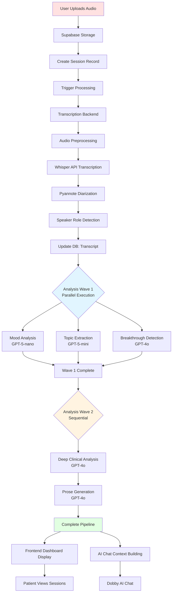
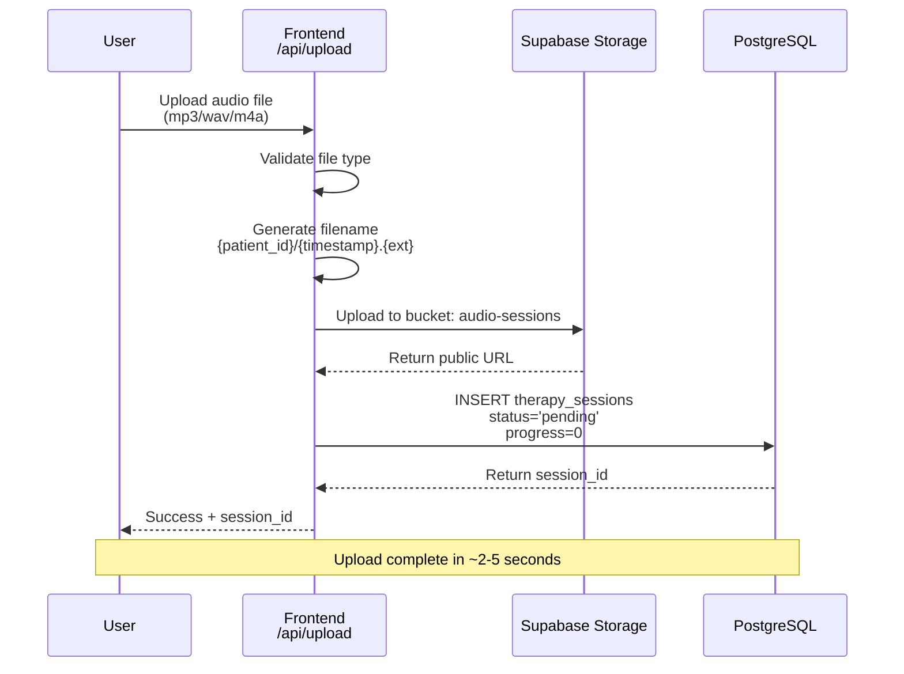
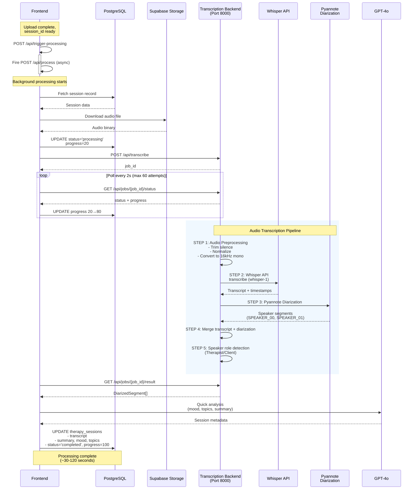
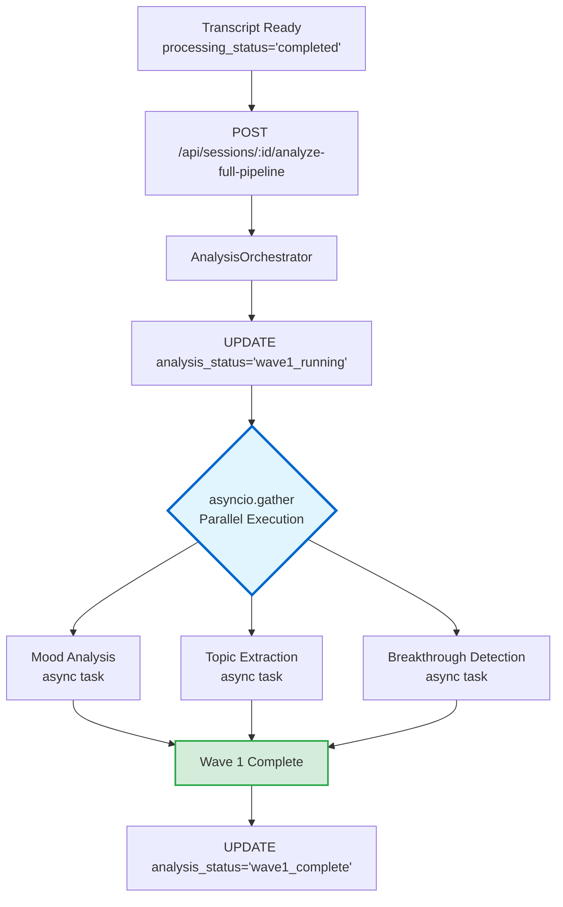
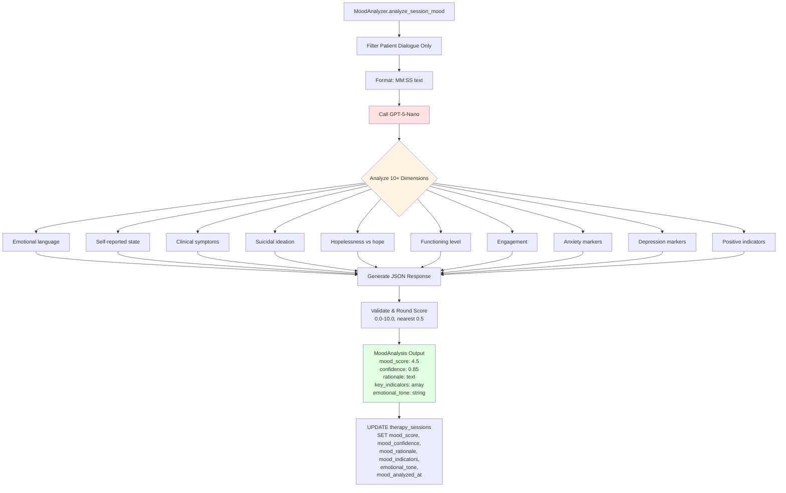
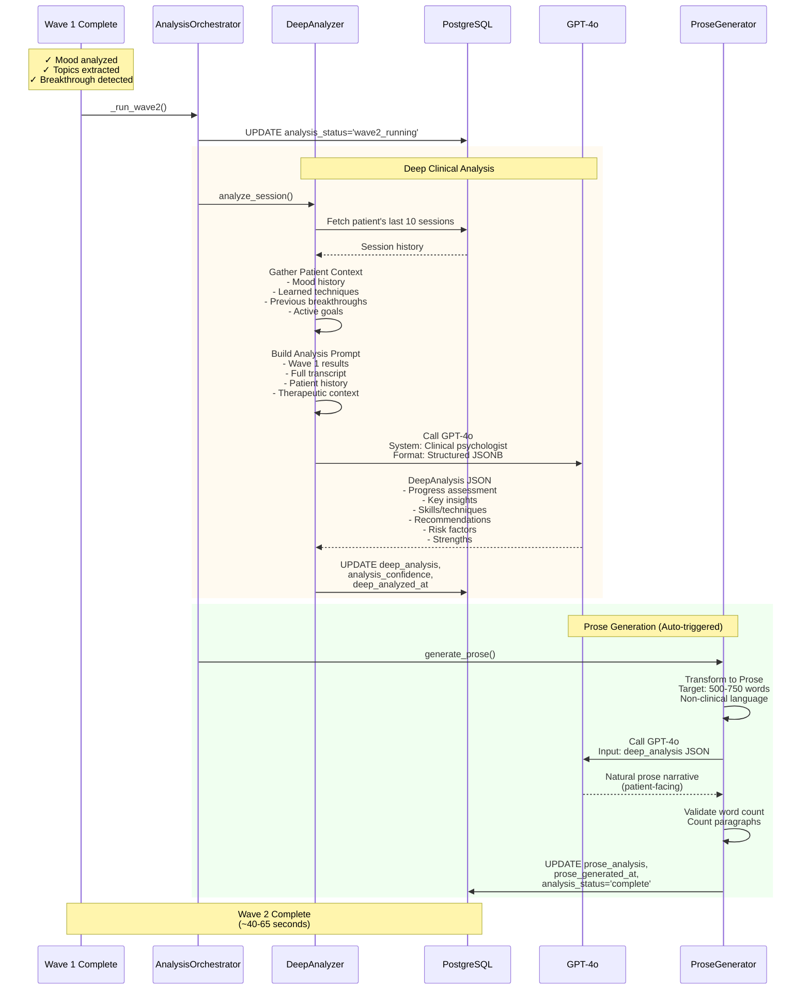
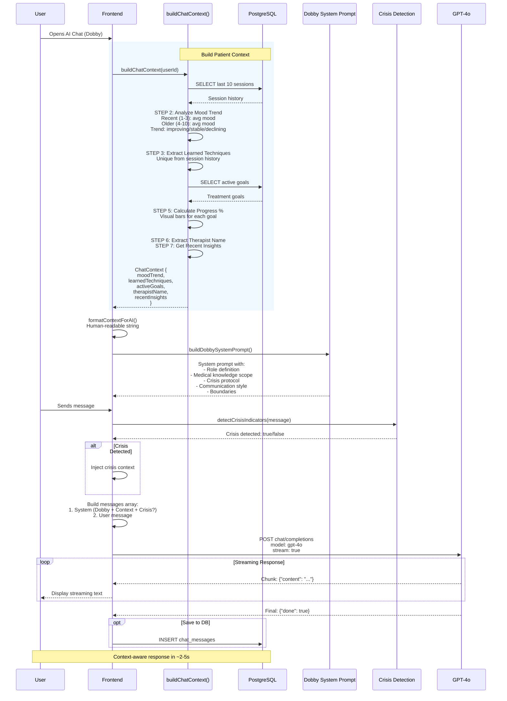
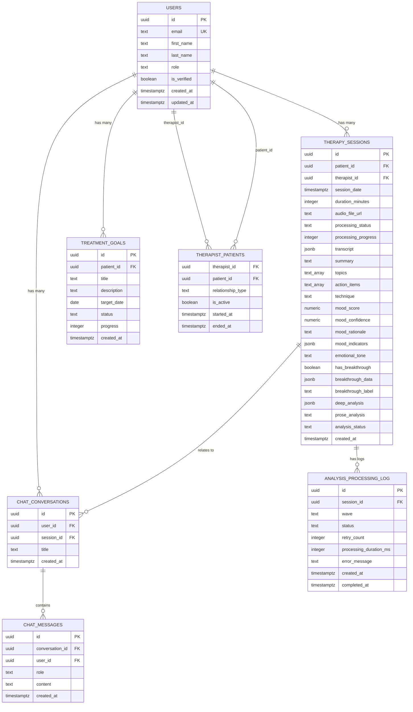

# TherapyBridge Complete Pipeline Flowchart

**Last Updated:** 2025-12-23
**Purpose:** Comprehensive documentation of the entire TherapyBridge data pipeline from audio upload to AI chat interactions.

---

## 📊 Flowchart Overview

This document contains **comprehensive Mermaid diagrams** visualizing the entire TherapyBridge system:

### Diagram Types Included:

| # | Diagram Type | Description | Location |
|---|--------------|-------------|----------|
| 1 | **Graph (TB)** | High-level pipeline architecture | System Architecture Overview |
| 2 | **Gantt Chart** | Processing timeline (0s → 190s) | System Architecture Overview |
| 3 | **Sequence Diagram** | Audio upload flow | Phase 1: Audio Upload |
| 4 | **Sequence Diagram** | Transcription pipeline with backend polling | Phase 2: Transcription |
| 5 | **Graph (TB)** | Wave 1 parallel orchestration | Phase 3: AI Analysis Wave 1 |
| 6 | **Flowchart (TD)** | Mood analysis service logic | Phase 3: Mood Analysis |
| 7 | **Sequence Diagram** | Wave 2 sequential analysis + prose | Phase 4: AI Analysis Wave 2 |
| 8 | **Sequence Diagram** | AI chat context building + crisis detection | Phase 6: AI Chat Context |
| 9 | **Graph (TD)** | Complete end-to-end data flow | Data Flow Summary |
| 10 | **Gantt Chart** | Complete pipeline timeline (6 sections) | Data Flow Summary |
| 11 | **ERD** | Database entity relationships | Database Schema |

**Total:** 11 Mermaid diagrams covering the entire system

### Quick Stats:

- **Total Processing Time:** ~3 minutes (upload → complete analysis)
- **Cost per Session:** ~$0.42 (Whisper + GPT-4o/5 models)
- **Stages:** 6 major phases (Upload, Transcription, Wave 1, Wave 2, Display, Chat)
- **AI Models Used:** 4 (GPT-5-nano, GPT-5-mini, GPT-4o x2)
- **Database Tables:** 7 core tables + 3 views + 2 functions

### Mermaid Diagram Viewing:

All diagrams use **Mermaid syntax** and can be viewed in:
- GitHub (native rendering)
- GitLab (native rendering)
- VS Code (with Mermaid extension)
- Online: [mermaid.live](https://mermaid.live)
- Documentation sites (Docusaurus, MkDocs, etc.)

---

## Table of Contents

1. [System Architecture Overview](#system-architecture-overview)
2. [Phase 1: Audio Upload & Storage](#phase-1-audio-upload--storage)
3. [Phase 2: Audio Transcription Pipeline](#phase-2-audio-transcription-pipeline)
4. [Phase 3: AI Analysis (Wave 1)](#phase-3-ai-analysis-wave-1)
5. [Phase 4: AI Analysis (Wave 2)](#phase-4-ai-analysis-wave-2)
6. [Phase 5: Frontend Data Display](#phase-5-frontend-data-display)
7. [Phase 6: AI Chat Context Building](#phase-6-ai-chat-context-building)
8. [Database Schema](#database-schema)
9. [API Endpoints Reference](#api-endpoints-reference)
10. [File Structure Reference](#file-structure-reference)

---

## System Architecture Overview

### High-Level Pipeline (Mermaid)



### Processing Stages Timeline

```mermaid
gantt
    title TherapyBridge Pipeline Timeline (Average Session)
    dateFormat X
    axisFormat %Ss

    section Upload
    User uploads audio              :0, 3s
    Store in Supabase               :3s

    section Transcription
    Audio preprocessing             :5s, 10s
    Whisper API transcription       :15s, 60s
    Pyannote diarization            :75s, 30s
    Speaker role detection          :105s, 5s
    Quick GPT-4o analysis           :110s, 10s

    section Wave 1 (Parallel)
    Mood analysis (GPT-5-nano)      :120s, 15s
    Topic extraction (GPT-5-mini)   :120s, 15s
    Breakthrough (GPT-4o)           :120s, 20s

    section Wave 2 (Sequential)
    Deep analysis (GPT-4o)          :140s, 25s
    Prose generation (GPT-4o)       :165s, 20s

    section Display
    Dashboard refresh               :185s, 2s
```

---

## Phase 1: Audio Upload & Storage

### Components

**Frontend:**
- **File:** `frontend/app/api/upload/route.ts`
- **Function:** `POST /api/upload`

**Storage:**
- **Service:** Supabase Storage
- **Bucket:** `audio-sessions`
- **Path Structure:** `{patient_id}/{timestamp}.{ext}`

**Database:**
- **Table:** `therapy_sessions`
- **Initial Fields:** 
  - `patient_id`, `therapist_id`, `session_date`
  - `audio_file_url`, `processing_status: 'pending'`, `processing_progress: 0`

### Flow Diagram



**Key Files:**
- `frontend/app/api/upload/route.ts` - Upload endpoint (118 lines)

**Key Functions:**
- `POST(request: NextRequest)` - Handles multipart form upload
- Validates: file type, patient_id, therapist_id
- Returns: `{ success: true, session_id, file_url }`

---

## Phase 2: Audio Transcription Pipeline

### Components

**Frontend Trigger:**
- **File:** `frontend/app/api/trigger-processing/route.ts`
- **Function:** `POST /api/trigger-processing` (fire-and-forget)

**Main Processing:**
- **File:** `frontend/app/api/process/route.ts`
- **Function:** `POST /api/process` (long-running, 5 min max)

**Backend Transcription Service:**
- **Location:** Separate microservice (runs on port 8000)
- **Endpoint:** `http://localhost:8000/api/transcribe`
- **Technology:** OpenAI Whisper API + Pyannote 3.1 diarization

**Audio Pipeline (Standalone):**
- **Files:** 
  - `audio-transcription-pipeline/src/pipeline.py` - CPU/API pipeline
  - `audio-transcription-pipeline/src/pipeline_gpu.py` - GPU/Vast.ai pipeline

### Flow Diagram



**Key Files:**
- `frontend/app/api/trigger-processing/route.ts` - Trigger endpoint (46 lines)
- `frontend/app/api/process/route.ts` - Main processing logic (292 lines)
- `audio-transcription-pipeline/src/pipeline.py` - Audio preprocessing + Whisper API
- `lib/speaker-role-detection.ts` - Speaker role labeling heuristics

**Key Functions:**
- `AudioPreprocessor.preprocess()` - Audio normalization
- `WhisperTranscriber.transcribe()` - OpenAI Whisper API with retries
- `detectSpeakerRoles()` - Therapist/Client role assignment

**Data Format:**
```typescript
interface DiarizedSegment {
  speaker: "Therapist" | "Client" | "SPEAKER_00" | "SPEAKER_01";
  text: string;
  start: number;  // seconds
  end: number;    // seconds
}
```

---

## Phase 3: AI Analysis (Wave 1)

### Components

**Orchestration:**
- **File:** `backend/app/services/analysis_orchestrator.py`
- **Class:** `AnalysisOrchestrator`
- **Execution:** Parallel (asyncio.gather)

**Analysis Services:**
1. **Mood Analysis** - `backend/app/services/mood_analyzer.py`
2. **Topic Extraction** - `backend/app/services/topic_extractor.py`
3. **Breakthrough Detection** - `backend/app/services/breakthrough_detector.py`

**Models:**
- Mood: `gpt-5-nano` (configured in `model_config.py`)
- Topics: `gpt-5-mini` (configured in `model_config.py`)
- Breakthrough: `gpt-4o` (uses o1-preview for complex reasoning)

### Flow Diagram



### Mood Analysis Service

**File:** `backend/app/services/mood_analyzer.py`



**Mood Scale:**
- `0.0-2.0` - Severe distress (suicidal ideation, crisis)
- `2.5-4.0` - Significant distress (moderate-severe symptoms)
- `4.5-5.5` - Mild distress to neutral
- `6.0-7.5` - Positive baseline (stable, functional)
- `8.0-10.0` - Very positive (hopeful, thriving)

### Topic Extraction Service

**File:** `backend/app/services/topic_extractor.py`

```
┌──────────────────────────────────────────────────────┐
│ TopicExtractor.extract_metadata()                    │
│                                                       │
│ INPUT:                                               │
│   - session_id                                       │
│   - segments (DiarizedSegment[]) - BOTH speakers     │
│                                                       │
│ STEP 1: Format Full Conversation                     │
│   - Include both Therapist AND Client dialogue       │
│   - Format: "[MM:SS] Therapist: ...\n"              │
│                                                       │
│ STEP 2: Call GPT-5-Mini (gpt-5-mini)                │
│   - System prompt: Clinical metadata extraction      │
│   - Includes TechniqueLibrary reference (80+ techs)  │
│   - Response format: JSON                            │
│   - Extracts:                                        │
│     * 1-2 main topics (specific, clinical)           │
│     * 2 action items (concrete homework)             │
│     * 1 therapeutic technique (from library)         │
│     * 2-sentence summary (max 150 chars)             │
│     * Confidence score                               │
│                                                       │
│ STEP 3: Validate Technique Against Library           │
│   - TechniqueLibrary.validate_and_standardize()      │
│   - Fuzzy matching, synonym detection                │
│   - Standardizes to canonical name                   │
│   - Example: "breathing" → "DBT - TIPP Skills"       │
│                                                       │
│ STEP 4: Truncate Summary (if needed)                 │
│   - Enforce 150 character limit                      │
│   - Intelligent word boundary handling               │
│   - Add "..." if truncated                           │
│                                                       │
│ OUTPUT:                                              │
│   SessionMetadata {                                  │
│     topics: ["Anxiety", "Relationship conflict"],    │
│     action_items: ["Practice TIPP", "Call psych"],   │
│     technique: "DBT - TIPP Skills",                  │
│     summary: "Patient experiencing severe anxiety.", │
│     confidence: 0.9                                  │
│   }                                                  │
└────────┬─────────────────────────────────────────────┘
         │
         ▼
┌──────────────────────────────────────────────────────┐
│ UPDATE therapy_sessions SET                          │
│   topics = ARRAY['Anxiety', 'Relationships'],        │
│   action_items = ARRAY['Practice TIPP', '...'],      │
│   technique = 'DBT - TIPP Skills',                   │
│   summary = '...',                                   │
│   extraction_confidence = 0.9,                       │
│   raw_meta_summary = {...},                          │
│   topics_extracted_at = NOW()                        │
│ WHERE id = session_id                                │
└──────────────────────────────────────────────────────┘
```

**Technique Library:**
- **File:** `backend/app/services/technique_library.py`
- **Modalities:** CBT, DBT, ACT, Mindfulness, Motivational Interviewing, EMDR, Psychodynamic, Solution-Focused
- **Total Techniques:** 80+
- **Validation:** Fuzzy matching, synonym detection, standardization

### Breakthrough Detection Service

**File:** `backend/app/services/breakthrough_detector.py`

```
┌──────────────────────────────────────────────────────┐
│ BreakthroughDetector.analyze_session()               │
│                                                       │
│ INPUT:                                               │
│   - transcript (DiarizedSegment[])                   │
│   - session_metadata                                 │
│                                                       │
│ STEP 1: Multi-Pass Pattern Detection                 │
│   - Identifies therapeutic breakthrough moments      │
│   - Types:                                           │
│     * Cognitive Insight                              │
│     * Emotional Processing                           │
│     * Behavioral Commitment                          │
│     * Relational Shift                               │
│   - Uses context window analysis                     │
│   - Assigns confidence scores                        │
│                                                       │
│ STEP 2: Select Primary Breakthrough                  │
│   - Highest confidence score above threshold         │
│   - Extract dialogue excerpt                         │
│   - Generate label (e.g., "Major Insight")           │
│                                                       │
│ OUTPUT:                                              │
│   BreakthroughAnalysis {                             │
│     has_breakthrough: true,                          │
│     primary_breakthrough: {                          │
│       type: "cognitive_insight",                     │
│       description: "...",                            │
│       label: "Major Insight",                        │
│       confidence: 0.92,                              │
│       timestamp_start: 420.5,                        │
│       timestamp_end: 485.2,                          │
│       evidence: [...]                                │
│     }                                                │
│   }                                                  │
└────────┬─────────────────────────────────────────────┘
         │
         ▼
┌──────────────────────────────────────────────────────┐
│ UPDATE therapy_sessions SET                          │
│   has_breakthrough = true,                           │
│   breakthrough_data = {...},                         │
│   breakthrough_label = 'Major Insight',              │
│   breakthrough_analyzed_at = NOW()                   │
│ WHERE id = session_id                                │
└──────────────────────────────────────────────────────┘
```

### Wave 1 Completion

```
┌──────────────────────────────────────────────────────┐
│ All 3 Wave 1 Services Complete                       │
│                                                       │
│ AnalysisOrchestrator checks:                         │
│   - mood_analyzed_at IS NOT NULL                     │
│   - topics_extracted_at IS NOT NULL                  │
│   - breakthrough_analyzed_at IS NOT NULL             │
│                                                       │
│ UPDATE therapy_sessions SET                          │
│   analysis_status = 'wave1_complete',                │
│   wave1_completed_at = NOW()                         │
└────────┬─────────────────────────────────────────────┘
         │
         ▼
     [Wave 2 Begins]
```

**Key Files:**
- `backend/app/services/analysis_orchestrator.py` - Coordinates all analysis (550 lines)
- `backend/app/services/mood_analyzer.py` - Mood analysis (238 lines)
- `backend/app/services/topic_extractor.py` - Topic/metadata extraction (359 lines)
- `backend/app/services/breakthrough_detector.py` - Breakthrough detection

**API Endpoints:**
- `POST /api/sessions/{id}/analyze-mood` - Manual mood analysis
- `POST /api/sessions/{id}/extract-topics` - Manual topic extraction
- `POST /api/sessions/{id}/analyze-breakthrough` - Manual breakthrough detection
- `POST /api/sessions/{id}/analyze-full-pipeline` - Trigger full Wave 1 + Wave 2

---

## Phase 4: AI Analysis (Wave 2)

### Components

**Deep Analysis:**
- **File:** `backend/app/services/deep_analyzer.py`
- **Class:** `DeepAnalyzer`
- **Model:** `gpt-4o` (complex clinical synthesis)

**Prose Generation:**
- **File:** `backend/app/services/prose_generator.py`
- **Class:** `ProseGenerator`
- **Model:** `gpt-4o` (patient-facing narrative)

**Prerequisites:** All Wave 1 analyses must be complete

### Flow Diagram



**Key Files:**
- `backend/app/services/deep_analyzer.py` - Deep clinical analysis
- `backend/app/services/prose_generator.py` - Patient-facing prose
- `backend/app/services/analysis_orchestrator.py` - Orchestration logic

**API Endpoints:**
- `POST /api/sessions/{id}/analyze-deep` - Manual deep analysis
- `POST /api/sessions/{id}/generate-prose-analysis` - Manual prose generation
- `GET /api/sessions/{id}/analysis-status` - Check pipeline status

---

## Phase 5: Frontend Data Display

### Components

**Data Fetching:**
- **File:** `frontend/hooks/useSessions.ts`
- **Function:** `useSessions(options)` - SWR-based session list fetching
- **File:** `frontend/hooks/useSession.ts`
- **Function:** `useSession(id)` - Single session fetching

**Storage Client:**
- **File:** `frontend/lib/supabase.ts`
- **Function:** Supabase client initialization

**Dashboard Pages:**
- **Patient Dashboard:** `frontend/app/patient/dashboard-v3/page.tsx`
- **Session Detail:** `frontend/app/patient/session/[id]/page.tsx`

### Flow Diagram

```
┌──────────────────────────────────────────────────────┐
│ Patient Dashboard Loads                              │
└────────┬─────────────────────────────────────────────┘
         │
         ▼
┌──────────────────────────────────────────────────────┐
│ useSessions({ patientId: userId })                   │
│                                                       │
│ SWR Configuration:                                   │
│   - Auto-refresh: 30s for in-progress sessions       │
│   - No refresh for completed sessions                │
│   - Deduplication: 2 minutes                         │
│   - Revalidate on reconnect: true                    │
└────────┬─────────────────────────────────────────────┘
         │
         ▼
┌──────────────────────────────────────────────────────┐
│ Supabase Query                                       │
│                                                       │
│ SELECT * FROM therapy_sessions                       │
│ WHERE patient_id = {userId}                          │
│ ORDER BY session_date DESC                           │
│ LIMIT 50                                             │
│                                                       │
│ Returns:                                             │
│   - id, session_date, duration_minutes               │
│   - processing_status, processing_progress           │
│   - summary, mood, topics, key_insights              │
│   - action_items, technique                          │
│   - mood_score, emotional_tone                       │
│   - has_breakthrough, breakthrough_label             │
│   - deep_analysis, prose_analysis                    │
│   - transcript (full)                                │
└────────┬─────────────────────────────────────────────┘
         │
         ▼
┌──────────────────────────────────────────────────────┐
│ Dashboard Components Render                          │
│                                                       │
│ 1. Session Cards (Timeline)                          │
│    - Display: date, summary, mood_score              │
│    - Topics, technique, breakthrough_label           │
│    - Visual: mood color-coding, star for milestone   │
│                                                       │
│ 2. Progress Patterns Card                            │
│    - Mood history chart (last 10 sessions)           │
│    - Trend: improving/stable/declining               │
│                                                       │
│ 3. Notes & Goals Card                                │
│    - Action items from recent sessions               │
│    - Active treatment goals                          │
│                                                       │
│ 4. Therapist Bridge Card                             │
│    - Therapist info, quick actions                   │
│                                                       │
│ 5. To-Do Card                                        │
│    - Aggregated action items from all sessions       │
└────────┬─────────────────────────────────────────────┘
         │
         ▼
┌──────────────────────────────────────────────────────┐
│ User Clicks Session → Navigate to Detail Page        │
└────────┬─────────────────────────────────────────────┘
         │
         ▼
┌──────────────────────────────────────────────────────┐
│ Session Detail Page                                  │
│                                                       │
│ 1. Transcript Viewer                                 │
│    - Display diarized conversation                   │
│    - Speaker labels (Therapist/Client)               │
│    - Timestamps                                      │
│    - Breakthrough highlight (if detected)            │
│                                                       │
│ 2. AI-Generated Insights                             │
│    - Prose analysis (patient-facing narrative)       │
│    - Key insights from deep_analysis                 │
│    - Recommendations                                 │
│                                                       │
│ 3. Session Metadata                                  │
│    - Date, duration, mood score                      │
│    - Topics, technique, action items                 │
│    - Breakthrough details (if any)                   │
└──────────────────────────────────────────────────────┘
```

**Key Files:**
- `frontend/hooks/useSessions.ts` - Session list hook (85 lines)
- `frontend/hooks/useSession.ts` - Single session hook
- `frontend/lib/supabase.ts` - Supabase client (102 lines)
- `frontend/app/patient/dashboard-v3/page.tsx` - Main dashboard
- `frontend/app/patient/dashboard-v3/components/SessionCard.tsx` - Session display

**Data Flow:**
1. SWR fetches from Supabase
2. Auto-refresh for in-progress sessions
3. Real-time updates via polling
4. Dashboard components consume session data
5. Session detail page displays full transcript + analysis

---

## Phase 6: AI Chat Context Building

### Components

**Context Builder:**
- **File:** `frontend/lib/chat-context.ts`
- **Function:** `buildChatContext(userId)` - Gathers patient context

**System Prompt:**
- **File:** `frontend/lib/dobby-system-prompt.ts`
- **Function:** `buildDobbySystemPrompt()` - Dobby AI persona

**Chat Endpoint:**
- **File:** `frontend/app/api/chat/route.ts`
- **Function:** `POST /api/chat` - Streaming GPT-4o chat

**Crisis Detection:**
- **File:** `frontend/lib/dobby-system-prompt.ts`
- **Function:** `detectCrisisIndicators()` - Keyword scanning

### Flow Diagram



**Example Context Injection:**

```typescript
// User message: "I'm feeling really anxious right now"

// System prompt includes:
`You are Dobby, a supportive AI therapy companion.

**Patient Context:**
- Mood trend: improving (6.2 → 7.5)
- Learned techniques: TIPP Skills, Box Breathing
- Recent session: Practiced grounding exercises
- Therapist: Dr. Smith

**Medical Knowledge:**
- You can explain TIPP (Temperature, Intense exercise, Paced breathing, Paired muscle relaxation)
- You can guide through 5-4-3-2-1 grounding

**Response Guidelines:**
- Validate their feelings first
- Suggest techniques they've already learned (TIPP, Box Breathing)
- Remind them of their progress (mood improving)
- Keep response 2-4 sentences
- Don't replace therapist - refer to Dr. Smith for complex issues`

// AI response (with context):
"I hear that you're feeling anxious right now, and that's completely valid. You've been doing really well with managing anxiety lately (your mood has been improving!). Would you like to try the TIPP skills you practiced with Dr. Smith? We could walk through the paced breathing technique together if that would help."
```

**Crisis Response Example:**

```typescript
// User message: "I don't see the point anymore. I just want to give up."

// Crisis detected → inject crisis context:
`🚨 CRISIS DETECTED IN USER MESSAGE

**Crisis Response Protocol:**
1. Validate their pain with compassion
2. Assess immediate safety (ask: "Are you thinking about hurting yourself?")
3. Provide crisis resources:
   - 988 Suicide & Crisis Lifeline (call/text)
   - Crisis Text Line: Text HOME to 741741
4. Encourage reaching out to therapist Dr. Smith IMMEDIATELY
5. Stay with them through the conversation
6. Flag conversation for therapist review

DO NOT:
- Minimize their feelings
- Say "it will get better" without validation
- End conversation abruptly
- Give medical advice

DO:
- Validate their pain
- Ask direct safety questions
- Provide immediate resources
- Encourage professional contact`

// AI response (crisis-aware):
"I'm really glad you reached out to me, and I want you to know that what you're feeling matters. I'm concerned about you right now - are you thinking about hurting yourself? 

Please know that there are people who can help immediately:
- 988 Suicide & Crisis Lifeline (call or text)
- Crisis Text Line: Text HOME to 741741

I also strongly encourage you to contact Dr. Smith right away. These feelings are treatable, and you don't have to face them alone. Can you tell me more about what's going on, or would you like me to help you connect with crisis support?"
```

**Key Files:**
- `frontend/lib/chat-context.ts` - Context building logic
- `frontend/lib/dobby-system-prompt.ts` - System prompt + crisis detection
- `frontend/app/api/chat/route.ts` - Chat endpoint (streaming)
- `frontend/contexts/ProcessingContext.tsx` - Global processing state
- `frontend/hooks/use-processing-status.ts` - Polling for upload status

---

## Database Schema

### Entity Relationship Diagram



### Core Tables

**`therapy_sessions`** - Main session table

```sql
CREATE TABLE therapy_sessions (
  -- Identity
  id UUID PRIMARY KEY DEFAULT gen_random_uuid(),
  patient_id UUID NOT NULL REFERENCES users(id),
  therapist_id UUID REFERENCES users(id),
  session_date TIMESTAMPTZ NOT NULL,
  duration_minutes INTEGER,
  
  -- Audio Processing
  audio_file_url TEXT,
  processing_status TEXT DEFAULT 'pending', -- pending, processing, completed, failed
  processing_progress INTEGER DEFAULT 0, -- 0-100
  
  -- Transcription Results
  transcript JSONB, -- DiarizedSegment[]
  
  -- Wave 1 Analysis (Parallel)
  summary TEXT, -- Initial quick summary
  mood TEXT, -- Deprecated (use mood_score)
  topics TEXT[], -- Main topics (1-2)
  key_insights TEXT[], -- Deprecated (use deep_analysis)
  action_items TEXT[], -- Homework/tasks (2)
  technique TEXT, -- Primary therapeutic technique
  
  -- Mood Analysis (Wave 1)
  mood_score NUMERIC(3,1), -- 0.0-10.0 (0.5 increments)
  mood_confidence NUMERIC(3,2), -- 0.0-1.0
  mood_rationale TEXT,
  mood_indicators JSONB, -- Key indicators array
  emotional_tone TEXT,
  mood_analyzed_at TIMESTAMPTZ,
  
  -- Topic Extraction (Wave 1)
  extraction_confidence NUMERIC(3,2), -- 0.0-1.0
  raw_meta_summary JSONB, -- Full AI response
  topics_extracted_at TIMESTAMPTZ,
  
  -- Breakthrough Detection (Wave 1)
  has_breakthrough BOOLEAN DEFAULT FALSE,
  breakthrough_data JSONB, -- Primary breakthrough details
  breakthrough_label TEXT, -- e.g., "Major Insight", "Emotional Release"
  breakthrough_analyzed_at TIMESTAMPTZ,
  
  -- Wave 2 Analysis (Sequential)
  deep_analysis JSONB, -- Comprehensive clinical analysis
  analysis_confidence NUMERIC(3,2), -- 0.0-1.0
  deep_analyzed_at TIMESTAMPTZ,
  
  -- Prose Analysis (Wave 2)
  prose_analysis TEXT, -- 500-750 word patient-facing narrative
  prose_generated_at TIMESTAMPTZ,
  
  -- Pipeline Status
  analysis_status TEXT, -- pending, wave1_running, wave1_complete, wave2_running, complete, failed
  wave1_completed_at TIMESTAMPTZ,
  
  -- Timestamps
  created_at TIMESTAMPTZ DEFAULT NOW(),
  updated_at TIMESTAMPTZ DEFAULT NOW()
);
```

**`users`** - User authentication

```sql
CREATE TABLE users (
  id UUID PRIMARY KEY DEFAULT gen_random_uuid(),
  email TEXT UNIQUE NOT NULL,
  first_name TEXT NOT NULL,
  last_name TEXT NOT NULL,
  role TEXT NOT NULL, -- 'therapist' or 'patient'
  is_verified BOOLEAN DEFAULT FALSE,
  created_at TIMESTAMPTZ DEFAULT NOW(),
  updated_at TIMESTAMPTZ DEFAULT NOW()
);
```

**`treatment_goals`** - Patient goals

```sql
CREATE TABLE treatment_goals (
  id UUID PRIMARY KEY DEFAULT gen_random_uuid(),
  patient_id UUID NOT NULL REFERENCES users(id),
  title TEXT NOT NULL,
  description TEXT,
  target_date DATE,
  status TEXT DEFAULT 'active', -- active, completed, paused, cancelled
  progress INTEGER DEFAULT 0, -- 0-100
  created_at TIMESTAMPTZ DEFAULT NOW(),
  updated_at TIMESTAMPTZ DEFAULT NOW()
);
```

**`chat_conversations`** - AI chat threads

```sql
CREATE TABLE chat_conversations (
  id UUID PRIMARY KEY DEFAULT gen_random_uuid(),
  user_id UUID NOT NULL REFERENCES users(id),
  session_id UUID REFERENCES therapy_sessions(id),
  title TEXT,
  created_at TIMESTAMPTZ DEFAULT NOW(),
  updated_at TIMESTAMPTZ DEFAULT NOW()
);
```

**`chat_messages`** - AI chat messages

```sql
CREATE TABLE chat_messages (
  id UUID PRIMARY KEY DEFAULT gen_random_uuid(),
  conversation_id UUID NOT NULL REFERENCES chat_conversations(id),
  user_id UUID NOT NULL REFERENCES users(id),
  role TEXT NOT NULL, -- 'user' or 'assistant'
  content TEXT NOT NULL,
  created_at TIMESTAMPTZ DEFAULT NOW()
);
```

**`analysis_processing_log`** - Pipeline monitoring

```sql
CREATE TABLE analysis_processing_log (
  id UUID PRIMARY KEY DEFAULT gen_random_uuid(),
  session_id UUID NOT NULL REFERENCES therapy_sessions(id),
  wave TEXT NOT NULL, -- 'mood', 'topics', 'breakthrough', 'deep'
  status TEXT NOT NULL, -- 'started', 'completed', 'failed'
  retry_count INTEGER DEFAULT 0,
  processing_duration_ms INTEGER,
  error_message TEXT,
  created_at TIMESTAMPTZ DEFAULT NOW(),
  completed_at TIMESTAMPTZ
);
```

### Database Views

**`patient_mood_trends`** - Mood analysis over time

```sql
CREATE VIEW patient_mood_trends AS
SELECT
  patient_id,
  session_date,
  mood_score,
  mood_confidence,
  emotional_tone,
  -- Rolling 3-session average
  AVG(mood_score) OVER (
    PARTITION BY patient_id
    ORDER BY session_date
    ROWS BETWEEN 2 PRECEDING AND CURRENT ROW
  ) AS rolling_avg_3
FROM therapy_sessions
WHERE mood_score IS NOT NULL
ORDER BY patient_id, session_date;
```

**`patient_topic_frequency`** - Topic tracking

```sql
CREATE VIEW patient_topic_frequency AS
SELECT
  patient_id,
  UNNEST(topics) AS topic,
  COUNT(*) AS frequency,
  MAX(session_date) AS last_discussed
FROM therapy_sessions
WHERE topics IS NOT NULL
GROUP BY patient_id, topic
ORDER BY patient_id, frequency DESC;
```

**`patient_technique_history`** - Technique usage

```sql
CREATE VIEW patient_technique_history AS
SELECT
  patient_id,
  technique,
  COUNT(*) AS usage_count,
  MAX(session_date) AS last_used
FROM therapy_sessions
WHERE technique IS NOT NULL
GROUP BY patient_id, technique
ORDER BY patient_id, usage_count DESC;
```

### Database Functions

**`get_analysis_pipeline_status(p_session_id UUID)`**

Returns complete pipeline status for a session.

```sql
CREATE FUNCTION get_analysis_pipeline_status(p_session_id UUID)
RETURNS TABLE (
  session_id UUID,
  analysis_status TEXT,
  mood_complete BOOLEAN,
  topics_complete BOOLEAN,
  breakthrough_complete BOOLEAN,
  wave1_complete BOOLEAN,
  deep_complete BOOLEAN,
  wave1_completed_at TIMESTAMPTZ,
  deep_analyzed_at TIMESTAMPTZ,
  recent_logs JSONB
) AS $$
BEGIN
  RETURN QUERY
  SELECT
    ts.id,
    ts.analysis_status,
    (ts.mood_analyzed_at IS NOT NULL) AS mood_complete,
    (ts.topics_extracted_at IS NOT NULL) AS topics_complete,
    (ts.breakthrough_analyzed_at IS NOT NULL) AS breakthrough_complete,
    (ts.wave1_completed_at IS NOT NULL) AS wave1_complete,
    (ts.deep_analyzed_at IS NOT NULL) AS deep_complete,
    ts.wave1_completed_at,
    ts.deep_analyzed_at,
    (
      SELECT jsonb_agg(
        jsonb_build_object(
          'wave', apl.wave,
          'status', apl.status,
          'created_at', apl.created_at,
          'error_message', apl.error_message
        )
        ORDER BY apl.created_at DESC
      )
      FROM analysis_processing_log apl
      WHERE apl.session_id = ts.id
      LIMIT 10
    ) AS recent_logs
  FROM therapy_sessions ts
  WHERE ts.id = p_session_id;
END;
$$ LANGUAGE plpgsql;
```

**`increment_chat_usage(p_user_id UUID)`**

Tracks chat message usage (currently unlimited).

```sql
CREATE FUNCTION increment_chat_usage(p_user_id UUID)
RETURNS VOID AS $$
BEGIN
  -- Track usage in separate table (future rate limiting)
  INSERT INTO chat_usage_log (user_id, timestamp)
  VALUES (p_user_id, NOW());
END;
$$ LANGUAGE plpgsql;
```

---

## API Endpoints Reference

### Frontend Next.js API Routes

| Endpoint | Method | Purpose | File |
|----------|--------|---------|------|
| `/api/upload` | POST | Upload audio to Supabase Storage + create session | `frontend/app/api/upload/route.ts` |
| `/api/trigger-processing` | POST | Fire-and-forget trigger for async processing | `frontend/app/api/trigger-processing/route.ts` |
| `/api/process` | POST | Long-running transcription + analysis (5 min max) | `frontend/app/api/process/route.ts` |
| `/api/status/[sessionId]` | GET | Check processing status (polling) | `frontend/app/api/status/[sessionId]/route.ts` |
| `/api/chat` | POST | Streaming GPT-4o chat with patient context | `frontend/app/api/chat/route.ts` |
| `/api/check-email` | POST | Email availability check (auth) | `frontend/app/api/check-email/route.ts` |
| `/api/test-supabase` | GET | Supabase connection test | `frontend/app/api/test-supabase/route.ts` |
| `/api/test-auth` | GET | Auth test endpoint | `frontend/app/api/test-auth/route.ts` |

### Backend FastAPI Endpoints

**Session Management:**

| Endpoint | Method | Purpose | File |
|----------|--------|---------|------|
| `/api/sessions/` | POST | Create new session record | `backend/app/routers/sessions.py` |
| `/api/sessions/{id}` | GET | Get session with breakthrough details | `backend/app/routers/sessions.py` |
| `/api/sessions/patient/{id}` | GET | Get all sessions for patient | `backend/app/routers/sessions.py` |
| `/api/sessions/{id}/upload-transcript` | POST | Upload transcript + trigger breakthrough | `backend/app/routers/sessions.py` |
| `/api/sessions/{id}/upload-audio` | POST | Upload audio to Supabase Storage | `backend/app/routers/sessions.py` |

**Wave 1 Analysis:**

| Endpoint | Method | Purpose | File |
|----------|--------|---------|------|
| `/api/sessions/{id}/analyze-mood` | POST | Analyze patient mood (Wave 1) | `backend/app/routers/sessions.py` |
| `/api/sessions/{id}/extract-topics` | POST | Extract topics/metadata (Wave 1) | `backend/app/routers/sessions.py` |
| `/api/sessions/{id}/analyze-breakthrough` | POST | Detect breakthrough moments (Wave 1) | `backend/app/routers/sessions.py` |

**Wave 2 Analysis:**

| Endpoint | Method | Purpose | File |
|----------|--------|---------|------|
| `/api/sessions/{id}/analyze-deep` | POST | Deep clinical analysis (Wave 2) | `backend/app/routers/sessions.py` |
| `/api/sessions/{id}/generate-prose-analysis` | POST | Generate patient-facing prose (Wave 2) | `backend/app/routers/sessions.py` |

**Pipeline Orchestration:**

| Endpoint | Method | Purpose | File |
|----------|--------|---------|------|
| `/api/sessions/{id}/analyze-full-pipeline` | POST | Run complete Wave 1 + Wave 2 pipeline | `backend/app/routers/sessions.py` |
| `/api/sessions/{id}/analysis-status` | GET | Get pipeline status with logs | `backend/app/routers/sessions.py` |

**Patient Data:**

| Endpoint | Method | Purpose | File |
|----------|--------|---------|------|
| `/api/sessions/patient/{id}/mood-history` | GET | Get mood timeline for patient | `backend/app/routers/sessions.py` |
| `/api/sessions/patient/{id}/breakthroughs` | GET | Get all breakthroughs for patient | `backend/app/routers/sessions.py` |
| `/api/sessions/patient/{id}/consistency` | GET | Calculate session attendance metrics | `backend/app/routers/sessions.py` |

**Technique Library:**

| Endpoint | Method | Purpose | File |
|----------|--------|---------|------|
| `/api/sessions/techniques/{name}/definition` | GET | Get technique definition (80+ library) | `backend/app/routers/sessions.py` |

### External Services

| Service | Endpoint | Purpose |
|---------|----------|---------|
| Transcription Backend | `http://localhost:8000/api/transcribe` | Submit audio for transcription |
| Transcription Backend | `http://localhost:8000/api/jobs/{id}/status` | Poll job status |
| Transcription Backend | `http://localhost:8000/api/jobs/{id}/result` | Retrieve diarized transcript |
| OpenAI Whisper API | `https://api.openai.com/v1/audio/transcriptions` | Speech-to-text |
| OpenAI Chat API | `https://api.openai.com/v1/chat/completions` | GPT-4o/GPT-5 models |
| Supabase Storage | `https://{project}.supabase.co/storage/v1/object/audio-sessions` | Audio file storage |
| Supabase Database | `https://{project}.supabase.co/rest/v1` | PostgreSQL queries |

---

## File Structure Reference

### Frontend (Next.js 16 + React 19)

```
frontend/
├── app/
│   ├── api/
│   │   ├── upload/route.ts                    # Audio upload endpoint
│   │   ├── process/route.ts                   # Audio processing endpoint
│   │   ├── trigger-processing/route.ts        # Async processing trigger
│   │   ├── status/[sessionId]/route.ts        # Processing status polling
│   │   ├── chat/route.ts                      # AI chat streaming endpoint
│   │   ├── check-email/route.ts               # Email validation
│   │   ├── test-supabase/route.ts             # Connection test
│   │   └── test-auth/route.ts                 # Auth test
│   ├── patient/
│   │   ├── dashboard-v3/
│   │   │   ├── page.tsx                       # Main patient dashboard
│   │   │   ├── upload/page.tsx                # Audio upload page
│   │   │   └── components/
│   │   │       ├── SessionCard.tsx            # Session display card
│   │   │       ├── ProgressPatternsCard.tsx   # Mood chart
│   │   │       ├── NotesGoalsCard.tsx         # Action items + goals
│   │   │       ├── ToDoCard.tsx               # Aggregated tasks
│   │   │       └── TherapistBridgeCard.tsx    # Therapist info
│   │   └── session/[id]/
│   │       └── page.tsx                       # Session detail + transcript
│   └── therapist/
│       └── dashboard/page.tsx                 # Therapist dashboard
├── components/
│   ├── error-boundary.tsx                     # Error handling wrapper
│   ├── providers.tsx                          # Global providers
│   ├── ui/                                    # Reusable UI components
│   └── session/
│       └── UploadModal.tsx                    # Upload modal UI
├── contexts/
│   ├── ProcessingContext.tsx                  # Global processing state
│   └── SessionDataContext.tsx                 # Session data provider
├── hooks/
│   ├── useSessions.ts                         # SWR session list hook
│   ├── useSession.ts                          # SWR single session hook
│   ├── use-processing-status.ts               # Poll processing status
│   ├── use-conversation-history.ts            # Chat history hook
│   └── use-delete-session.ts                  # Delete session hook
├── lib/
│   ├── supabase.ts                            # Supabase client config
│   ├── chat-context.ts                        # Build patient context for AI
│   ├── dobby-system-prompt.ts                 # Dobby AI persona + crisis detection
│   ├── speaker-role-detection.ts              # Therapist/Client labeling
│   ├── api-client.ts                          # API fetcher
│   ├── api-config.ts                          # API configuration
│   └── types.ts                               # TypeScript types
└── .env.local
    ├── NEXT_PUBLIC_SUPABASE_URL
    ├── NEXT_PUBLIC_SUPABASE_ANON_KEY
    ├── NEXT_PUBLIC_API_URL
    ├── NEXT_PUBLIC_USE_REAL_API
    └── OPENAI_API_KEY
```

### Backend (FastAPI + Supabase)

```
backend/
├── app/
│   ├── main.py                                # FastAPI app entry point
│   ├── database.py                            # Supabase client + helpers
│   ├── config.py                              # Environment config
│   ├── routers/
│   │   └── sessions.py                        # All session endpoints (1294 lines)
│   ├── services/
│   │   ├── mood_analyzer.py                   # Mood analysis (GPT-5-nano)
│   │   ├── topic_extractor.py                 # Topic extraction (GPT-5-mini)
│   │   ├── breakthrough_detector.py           # Breakthrough detection (GPT-4o)
│   │   ├── deep_analyzer.py                   # Deep clinical analysis (GPT-4o)
│   │   ├── prose_generator.py                 # Prose narrative (GPT-4o)
│   │   ├── analysis_orchestrator.py           # Pipeline orchestration (550 lines)
│   │   └── technique_library.py               # 80+ therapeutic techniques
│   ├── models/
│   │   └── db_models.py                       # SQLAlchemy models
│   ├── auth/
│   │   ├── router.py                          # Auth endpoints
│   │   └── schemas.py                         # Auth request/response models
│   └── config/
│       └── model_config.py                    # AI model configuration
├── supabase/
│   └── migrations/
│       ├── 001_initial_schema.sql             # Users + sessions tables
│       ├── 002_add_mood_analysis.sql          # Mood fields
│       ├── 003_add_topic_extraction.sql       # Topic fields
│       ├── 004_add_deep_analysis.sql          # Deep analysis fields
│       ├── 005_add_breakthrough_label.sql     # Breakthrough label
│       ├── 006_add_prose_analysis.sql         # Prose fields
│       └── 007_add_demo_mode_support.sql      # Demo data support
├── tests/
│   ├── test_topic_extraction.py               # Topic extraction tests
│   ├── test_mood_analysis.py                  # Mood analysis tests
│   └── conftest.py                            # Test fixtures
├── requirements.txt                           # Python dependencies
├── .env
│   ├── DATABASE_URL
│   ├── OPENAI_API_KEY
│   ├── JWT_SECRET
│   ├── AWS_ACCESS_KEY_ID
│   ├── AWS_SECRET_ACCESS_KEY
│   └── SMTP credentials
└── README.md
```

### Audio Transcription Pipeline (Standalone)

```
audio-transcription-pipeline/
├── src/
│   ├── pipeline.py                            # CPU/API pipeline (200+ lines)
│   ├── pipeline_gpu.py                        # GPU/Vast.ai pipeline
│   ├── gpu_audio_ops.py                       # GPU audio processing
│   └── performance_logger.py                  # Performance monitoring
├── tests/
│   ├── test_full_pipeline.py                  # End-to-end tests
│   ├── samples/                               # Test audio files
│   └── outputs/                               # JSON transcripts
├── scripts/
│   ├── setup.sh                               # CPU setup
│   └── setup_gpu.sh                           # GPU setup (Vast.ai)
├── requirements.txt                           # Pipeline dependencies
├── .env
│   ├── OPENAI_API_KEY                         # Whisper API
│   └── HUGGINGFACE_TOKEN                      # Pyannote diarization
└── README.md
```

---

## Data Flow Summary

### Complete End-to-End Flow

```mermaid
graph TD
    Start([User Uploads Audio]) --> Upload[POST /api/upload]
    Upload --> Storage[Supabase Storage]
    Storage --> CreateSession[INSERT therapy_sessions<br/>status: pending]
    CreateSession --> SessionID[Return session_id]

    SessionID --> Trigger[POST /api/trigger-processing]
    Trigger --> Process[POST /api/process<br/>Background Task]
    Process --> Download[Download from Storage]
    Download --> Backend[POST Transcription Backend]

    Backend --> Pipeline{Audio Pipeline}
    Pipeline --> P1[1. Preprocess Audio]
    Pipeline --> P2[2. Whisper API]
    Pipeline --> P3[3. Pyannote Diarization]
    Pipeline --> P4[4. Merge Segments]
    Pipeline --> P5[5. Speaker Role Detection]

    P1 --> P2 --> P3 --> P4 --> P5
    P5 --> Transcript[DiarizedSegment Array]

    Transcript --> QuickAI[GPT-4o Quick Analysis]
    QuickAI --> UpdateTranscript[UPDATE therapy_sessions<br/>transcript, summary, mood<br/>status: completed]

    UpdateTranscript --> Wave1Start[POST /api/sessions/:id/analyze-full-pipeline]

    Wave1Start --> W1{Wave 1 Parallel<br/>asyncio.gather}
    W1 --> W1A[Mood Analysis<br/>GPT-5-nano]
    W1 --> W1B[Topic Extraction<br/>GPT-5-mini]
    W1 --> W1C[Breakthrough Detection<br/>GPT-4o]

    W1A --> W1Update[UPDATE mood_score,<br/>topics, breakthrough]
    W1B --> W1Update
    W1C --> W1Update

    W1Update --> W1Complete[analysis_status:<br/>wave1_complete]

    W1Complete --> W2Start{Wave 2 Sequential}
    W2Start --> W2A[Deep Analysis<br/>GPT-4o]
    W2A --> W2B[Prose Generation<br/>GPT-4o]
    W2B --> W2Complete[analysis_status:<br/>complete]

    W2Complete --> Display[Frontend Display]
    Display --> Dashboard[Dashboard Components<br/>SessionCard, ProgressPatternsCard,<br/>NotesGoalsCard, ToDoCard]
    Display --> Detail[Session Detail Page<br/>Transcript + Analysis]

    W2Complete --> ChatContext[AI Chat Context]
    ChatContext --> BuildContext[buildChatContext<br/>Mood trends, techniques,<br/>goals, insights]
    BuildContext --> UserMessage[User sends message]
    UserMessage --> Crisis{Crisis Detection}
    Crisis -->|Yes| InjectCrisis[Inject crisis context]
    Crisis -->|No| BuildPrompt[Build messages array]
    InjectCrisis --> BuildPrompt
    BuildPrompt --> StreamGPT[GPT-4o Streaming]
    StreamGPT --> DisplayChat[Display chat response]

    style Start fill:#ffe1e1
    style W1 fill:#e1f5ff
    style W2Start fill:#fff4e1
    style W2Complete fill:#e1ffe1
    style Crisis fill:#ffcccc
```



### Processing Timeline Summary

```mermaid
gantt
    title Complete TherapyBridge Pipeline - End to End
    dateFormat X
    axisFormat %Mm %Ss

    section 1. Upload
    User upload + Storage           :0, 5s

    section 2. Transcription
    Audio preprocessing             :5s, 10s
    Whisper API call                :15s, 60s
    Pyannote diarization            :75s, 30s
    Speaker role detection          :105s, 5s
    Quick GPT-4o analysis           :110s, 10s
    Update DB (completed)           :120s

    section 3. Wave 1 (Parallel)
    Mood analysis (GPT-5-nano)      :120s, 15s
    Topic extraction (GPT-5-mini)   :120s, 15s
    Breakthrough (GPT-4o)           :120s, 20s
    Wave 1 complete                 :140s

    section 4. Wave 2 (Sequential)
    Deep analysis (GPT-4o)          :140s, 25s
    Prose generation (GPT-4o)       :165s, 20s
    Wave 2 complete                 :185s

    section 5. Display
    Dashboard refresh               :185s, 2s
    Patient views session           :187s

    section 6. AI Chat
    Build context                   :milestone, 187s, 0s
    User sends message              :187s, 1s
    GPT-4o streaming response       :188s, 3s
```

---

## Technology Stack

**Frontend:**
- Next.js 16 (App Router)
- React 19
- TypeScript
- Tailwind CSS
- SWR (data fetching)
- Supabase Client
- OpenAI SDK (chat streaming)
- Framer Motion (animations)

**Backend:**
- FastAPI (Python 3.13)
- Supabase (PostgreSQL + Storage)
- OpenAI API (GPT-4o, GPT-5-nano, GPT-5-mini)
- Asyncio (parallel processing)
- Tenacity (retry logic)

**Audio Pipeline:**
- Pydub (audio preprocessing)
- OpenAI Whisper API (transcription)
- Pyannote.audio 3.1 (speaker diarization)
- Python 3.13

**Infrastructure:**
- Supabase (hosted PostgreSQL + Storage)
- Vercel (frontend hosting)
- Vast.ai (GPU instances for local transcription)

---

## Key Insights

### Processing Stages

1. **Upload (2-5 seconds)**
   - Supabase Storage upload
   - Session record creation
   - Returns immediately

2. **Transcription (30-120 seconds)**
   - Audio preprocessing
   - Whisper API transcription
   - Pyannote diarization
   - Speaker role detection
   - Quick GPT-4o analysis

3. **Wave 1 (15-30 seconds)**
   - Parallel execution
   - Mood, topics, breakthrough
   - No dependencies between services

4. **Wave 2 (20-40 seconds)**
   - Sequential execution
   - Requires Wave 1 completion
   - Deep analysis + prose generation

**Total Time:** ~2-3 minutes from upload to complete analysis

### Cost Analysis (per session)

- Whisper API: ~$0.006/minute (avg 50 min session = $0.30)
- GPT-4o (quick analysis): ~$0.01
- GPT-5-nano (mood): ~$0.002
- GPT-5-mini (topics): ~$0.005
- GPT-4o (breakthrough): ~$0.02
- GPT-4o (deep): ~$0.03
- GPT-4o (prose): ~$0.02
- **Total per session:** ~$0.42

### Scalability Considerations

**Current Bottlenecks:**
1. Whisper API rate limits (50 RPM)
2. Pyannote GPU processing (if local)
3. Single transcription backend instance

**Scalability Solutions:**
- Queue-based processing (Redis + Celery)
- Multiple transcription workers
- Batch processing for Wave 1 analyses
- Caching for repeat analyses

---

## Monitoring & Debugging

### Key Logs

**Frontend:**
- `[Upload API]` - Upload endpoint logs
- `[Process]` - Processing pipeline logs
- `[Chat API]` - Chat endpoint logs

**Backend:**
- `🚀 Starting full analysis pipeline` - Pipeline start
- `📊 Running Wave 1 (parallel)` - Wave 1 execution
- `🧠 Running Wave 2 (deep analysis)` - Wave 2 execution
- `✅ Wave 1 complete` - Wave 1 success
- `✓ Background: Full pipeline complete` - Full pipeline success

**Database:**
- `analysis_processing_log` table - All wave execution logs
- `get_analysis_pipeline_status()` function - Real-time status

### Error Handling

**Retry Logic:**
- Max 3 retries per wave
- Exponential backoff (2s, 4s, 8s)
- Timeout: 5 minutes per wave

**Graceful Degradation:**
- If Wave 1 fails: Session still usable (has transcript)
- If Wave 2 fails: Wave 1 results still available
- If chat context fails: Chat still works (no personalization)

---

**End of Flowchart**
